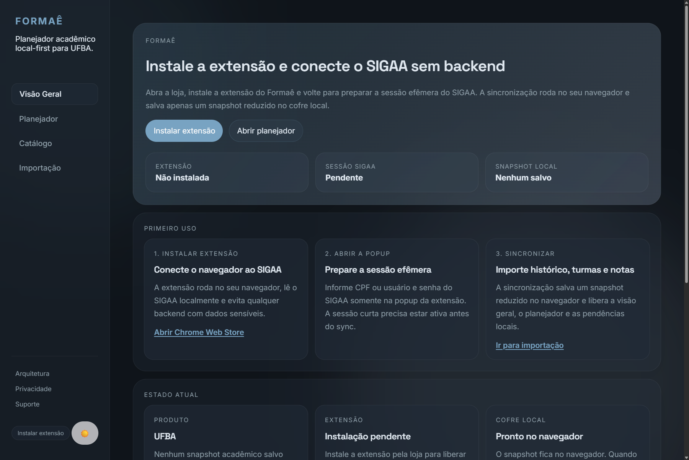
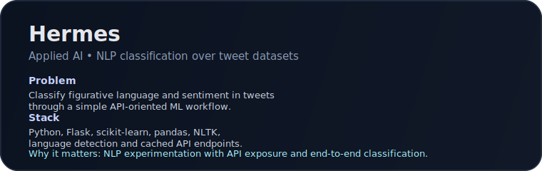
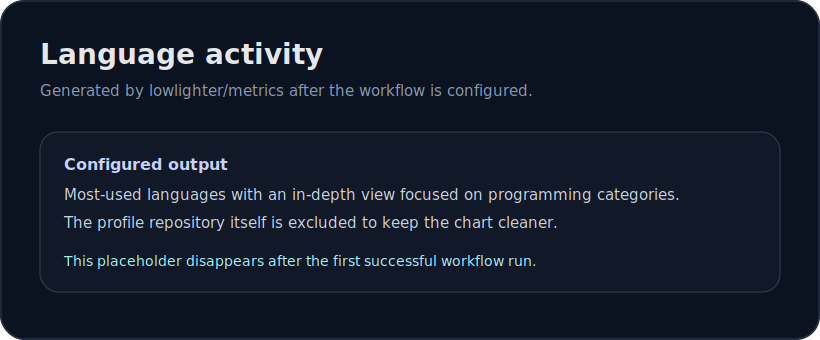

<picture>
  
</picture>

# Alex Lira

Backend, data and automation engineer building practical software with a growing focus on applied AI.

Based in Salvador, BA, Brazil. I am a Computer Engineering student at UFBA and I like systems that stay useful under real constraints: APIs, workflows, search, observability, local-first product design and ML features that actually earn their complexity.

  <a href="https://www.linkedin.com/in/alexdlneto/">LinkedIn</a>
  ·
  <a href="https://github.com/Mentorzx?tab=repositories">Repositories</a>
  ·
  <a href="https://github.com/Mentorzx?tab=overview&from=2026-01-01&to=2026-12-31">GitHub activity</a>

## What I build

<table>
  <tr>
    <td width="33%">
      <strong>Backend</strong>  
      Python services, APIs, modular architectures and operational tooling designed for validation, repeatability and clean failure handling.
    </td>
    <td width="33%">
      <strong>Data</strong>  
      Semantic search, vector indexing, structured outputs, document pipelines and analytics-friendly workflows that connect raw inputs to useful decisions.
    </td>
    <td width="33%">
      <strong>Applied AI</strong>  
      Practical NLP, ranking, classification and audio-processing work, with a preference for systems where the model is part of the product instead of the whole pitch.
    </td>
  </tr>
</table>

## Selected projects

### Formae

[Formae](https://github.com/Mentorzx/formae) is a local-first academic assistant for UFBA. It combines a static React/Vite PWA, a browser extension and a shared Rust/WASM core so sensitive academic data stays in the browser instead of a central backend.

<table>
  <tr>
    <td width="50%">
      
    </td>
    <td width="50%">
      
    </td>
  </tr>
  <tr>
    <td width="50%">
      
    </td>
    <td width="50%">
      
    </td>
  </tr>
</table>

## Evidence and experience

- Built and maintained Python-based systems across development, QA, automation and support contexts, including APIs, operational workflows and internal tooling.
- Shipped portfolio work around semantic search, vector indexing, NLP classification, local-first product architecture and structured document generation.
- Kept a validation-first mindset from QA and support experience, which still shows up in how I design flows, tests, readmes and failure handling.
- Prefer architecture choices that fit the problem: local-first when privacy matters, modular monoliths when delivery speed matters, typed boundaries and explicit contracts when maintainability matters.

## Tech map

| Focus | Tools and technologies used across projects |
| --- | --- |
| Backend | Python, FastAPI, Flask, SQLite, PostgreSQL, Redis, Docker, YAML-driven orchestration |
| Data / ML | FAISS, sentence-transformers, scikit-learn, pandas, vector search, NLP pipelines, audio transcription |
| Product / Platform | TypeScript, React, Vite, PWA, browser extensions (MV3), Rust/WASM, GitHub Actions, pytest, mypy, Ruff |

## GitHub dashboard

  
  

Metrics refresh through GitHub Actions after the `METRICS_TOKEN` secret is configured in this repository.

## Opportunities

I am open to backend, data and applied AI opportunities.

The best public contact point is [LinkedIn](https://www.linkedin.com/in/alexdlneto/).
