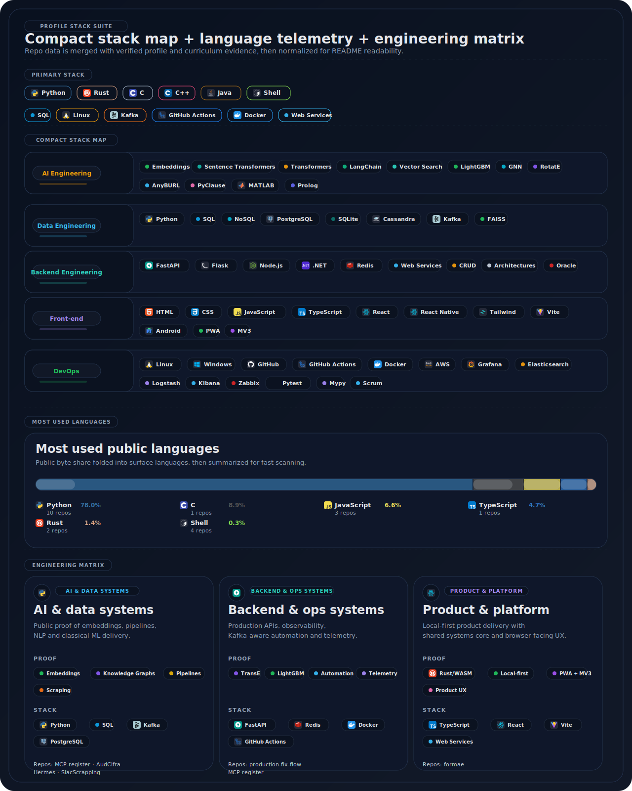

  

Best fit:

- Backend, data/AI engineering, automation and systems-heavy product/platform roles.
- Problems that need clear runtime boundaries, observability, practical ML/search layers, and execution across the whole system.
- Teams that value autonomy, engineering judgment, and the ability to turn messy requirements into working software.

Strongest public proofs: [production-fix-flow](https://github.com/Mentorzx/production-fix-flow), [MCP-register](https://github.com/Mentorzx/MCP-register), and [formae](https://github.com/Mentorzx/formae). Best contact: [LinkedIn](https://www.linkedin.com/in/alexdlneto/).

[Public repositories](https://github.com/Mentorzx?tab=repositories) • [Formae live demo](https://mentorzx.github.io/formae/)

  
  
  

  
  
  
  
  

## Technical signal

  

Primary stack, public language mix, and engineering surfaces are curated from public repository data plus curriculum-backed evidence, while keeping the layout readable on GitHub desktop and mobile.

## Strongest proofs

These are the repositories that best show system design, execution, and range.

  

  

  

  
More proof, product context, and public telemetry

    
  

    
  

    
  

    
  

    
  

