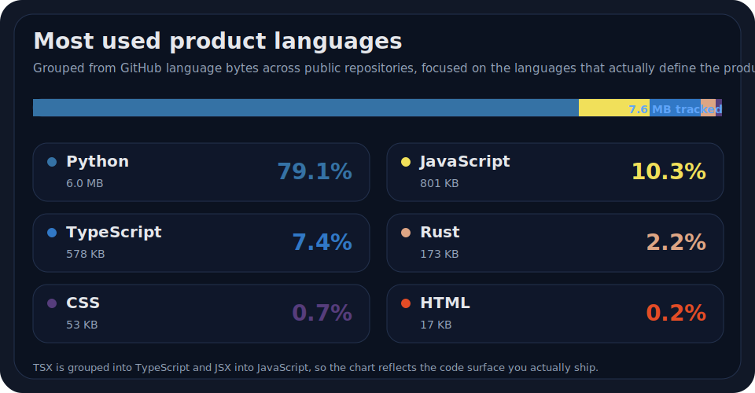

  

  

<table align="center" border="0" cellpadding="8" cellspacing="14">
  <tr>
    <td align="center">
      
    </td>
    <td align="center">
      
    </td>
    <td align="center">
      
    </td>
  </tr>
</table>

<table align="center" border="0" cellpadding="5" cellspacing="9">
  <tr>
    <td align="center">
      
    </td>
    <td align="center">
      
    </td>
    <td align="center">
      
    </td>
    <td align="center">
      
    </td>
  </tr>
  <tr>
    <td align="center">
      
    </td>
    <td align="center">
      
    </td>
    <td align="center">
      
    </td>
    <td align="center">
      
    </td>
  </tr>
</table>

  

 

  
<b>Compact stack map</b>, color-grouped and grounded in the actual repo surface, especially the bigger <code>production-fix-flow</code> toolbox and the Rust/WASM layer behind <code>formae</code>.

<table align="center" width="100%" border="0" cellpadding="8" cellspacing="0">
  <tr>
    <td width="18%" valign="top" bgcolor="#1d2430">
      <b>Languages</b>
    </td>
    <td>
      
      
      
      
      
    </td>
  </tr>
  <tr>
    <td valign="top" bgcolor="#1d2430">
      <b>APIs &amp; ops</b>
    </td>
    <td>
      
      
      
      
      
      
      
      
      
      
      
      
    </td>
  </tr>
  <tr>
    <td valign="top" bgcolor="#1d2430">
      <b>Data &amp; ML</b>
    </td>
    <td>
      
      
      
      
      
      
      
      
      
      
      
      
      
      
      
    </td>
  </tr>
  <tr>
    <td valign="top" bgcolor="#1d2430">
      <b>Validation</b>
    </td>
    <td>
      
      
      
      
      
      
      
      
      
      
      
      
      
    </td>
  </tr>
  <tr>
    <td valign="top" bgcolor="#1d2430">
      <b>Client &amp; delivery</b>
    </td>
    <td>
      
      
      
      
      
      
      
      
      
    </td>
  </tr>
  <tr>
    <td valign="top" bgcolor="#1d2430">
      <b>PFF Rust kernels</b>
    </td>
    <td>
      
      
      
      
      
      
      
      
    </td>
  </tr>
</table>

  

## ⚙️ Architecture & engineering matrix

<table align="center" width="100%" border="0" cellpadding="12" cellspacing="0">
  <tr>
    <td width="50%" align="center" valign="top">
      <h3>🧠 AI, data & search</h3>
      <i>Feature engineering, vector retrieval and NLP</i>
        
      
        
      
<b>Supporting:</b> FAISS, pandas, sentence-transformers, embeddings, classical ML and audio analysis.

    </td>
    <td width="50%" align="center" valign="top">
      <h3>🌩️ Backend & distributed orchestration</h3>
      <i>APIs, storage, workers and observability</i>
        
      
        
      
<b>Supporting:</b> FastMCP, Celery, Pydantic, typed config, JSON logging, YAML manifests and containerized runtimes.

    </td>
  </tr>
  <tr>
    <td colspan="2" align="center" valign="top">
      <h3>⚛️ Product core & platform interfaces</h3>
      <i>Client-side architecture, WASM and delivery</i>
        
      
        
      
<b>Supporting:</b> WebAssembly, PWA delivery, MV3 extensions, browser-side privacy and GitHub Pages shipping.

    </td>
  </tr>
</table>

  

## 📊 Engineering dashboard & telemetry

  

 

  

  

## 🏆 Engineering proof of work

<table align="center" width="100%" border="0" cellpadding="15" cellspacing="15">
  <tr>
    <td width="50%" align="center" valign="top">
      <h3>🛡️ <a href="https://github.com/Mentorzx/formae">Formaê</a></h3>
      
        
      Local-first academic planning, privacy by browser boundary.
        
      
      
      
      
      
    </td>
    <td width="50%" align="center" valign="top">
      <h3>🧠 <a href="https://github.com/Mentorzx/MCP-register">MCP-register</a></h3>
      
        
      Semantic retrieval server, local embeddings, clean runtime boundaries.
        
      
      
      
      
      
    </td>
  </tr>
  <tr>
    <td width="50%" align="center" valign="top">
      <h3>🎵 <a href="https://github.com/Mentorzx/AudCifra">AudCifra</a></h3>
      
        
      Audio-to-document pipeline for transcription, chords and export.
        
      
      
      
      
      
    </td>
    <td width="50%" align="center" valign="top">
      <h3>📨 <a href="https://github.com/Mentorzx/Hermes">Hermes</a></h3>
      
        
      NLP API surface for sentiment, figurative language and trends.
        
      
      
      
      
      
    </td>
  </tr>
  <tr>
    <td colspan="2" align="center" valign="top">
      <h3>🐳 <a href="https://github.com/Mentorzx/production-fix-flow">production-fix-flow</a></h3>
      
        
      Validation-first orchestration for APIs, workers, runtime guards and operational tooling.
        
      
      
      
      
      
      
      
      
    </td>
  </tr>
</table>

  
   
  Open to backend, data and applied AI opportunities. Best public contact point: <a href="https://www.linkedin.com/in/alexdlneto/">LinkedIn</a>.

